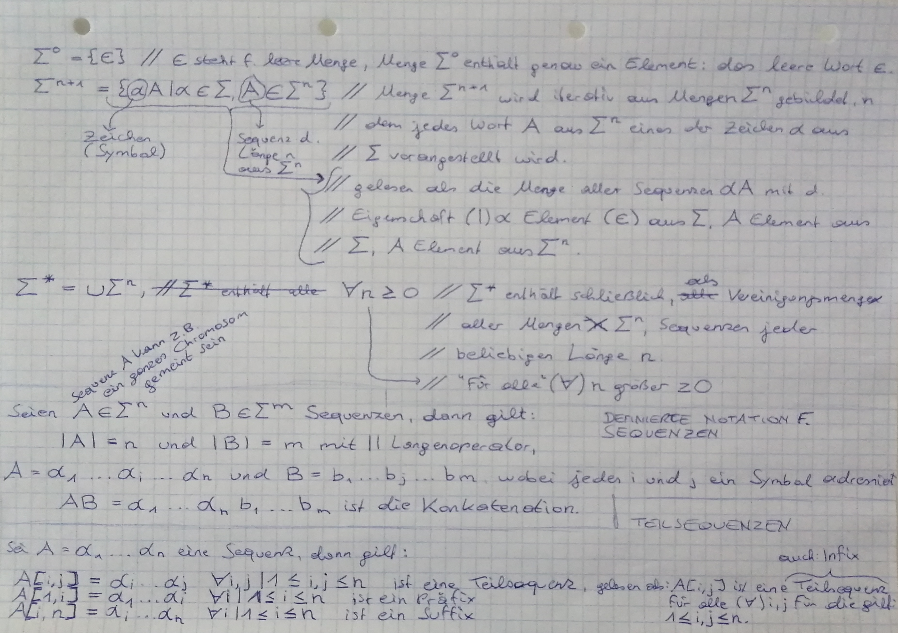
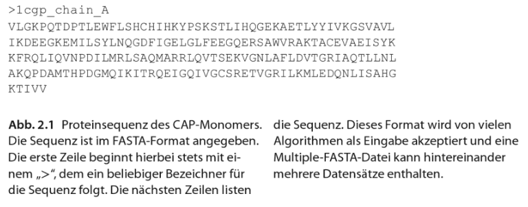

# bioinformatics - basics, overview, algorithms

## initial hyperlinks

* [encode project](https://www.encodeproject.org/)
* [sources download](https://application.wiley-vch.de/HOME/bioinformatik/index.html)

## basics in biology

* [dna](https://en.wikipedia.org/wiki/DNA)
* [genetical code](https://de.wikipedia.org/wiki/Genetischer_Code)
* [transcription](https://de.wikipedia.org/wiki/Transkription_(Biologie))
* [rna](https://en.wikipedia.org/wiki/RNA)
* [proteins](https://en.wikipedia.org/wiki/Protein)
* [peptide bond](https://de.wikipedia.org/wiki/Peptidbindung)
* [ramachandran plot](https://en.wikipedia.org/wiki/Ramachandran_plot)
* [protein structure](https://en.wikipedia.org/wiki/Protein_structure)
* [alpha helix](https://en.wikipedia.org/wiki/Alpha_helix)
* [beta falt](https://de.wikipedia.org/wiki/%CE%92-Faltblatt)
* [protein domain](https://en.wikipedia.org/wiki/Protein_domain)
* [proteinfamily](https://en.wikipedia.org/wiki/Protein_family)
* [Enzyme](https://en.wikipedia.org/wiki/Enzyme)
* [protein complex](https://en.wikipedia.org/wiki/Protein_complex)
* [evolutionaere prozesse](https://de.wikipedia.org/wiki/Evolution#:~:text=Diese%20Prozesse%20sind%20die%20zentrale,%2C%20Rekombination%2C%20Selektion%20und%20Gendrift.)
* Fachbegriffe
    * [Homologie](https://www.bionity.com/de/lexikon/Homologie_%28Biologie%29.html)
    * [Genotyp](https://www.bionity.com/de/lexikon/Genotyp.html)
    * [Phänotyp](https://www.bionity.com/de/lexikon/Ph%C3%A4notyp.html)
    * [Prokaryont](https://www.bionity.com/de/lexikon/Prokaryoten.html)
    * [Eukaryont](http://www.zytologie-online.net/)
    * [Taxonomische Nomenklatur](https://de.wikipedia.org/wiki/Nomenklatur_(Biologie))
    * [Mikroorganismen](https://de.wikipedia.org/wiki/Mikroorganismus)
    * [Gramfärbung](https://de.wikipedia.org/wiki/Gram-F%C3%A4rbung)
    * [Genom](https://de.wikipedia.org/wiki/Genom)
    * [Metagenom](https://de.wikipedia.org/wiki/Metagenomik)
    * [Systembiologie](https://de.wikipedia.org/wiki/Systembiologie)
    * [Genomik](https://de.wikipedia.org/wiki/Genom)
    * [Transkriptomik](https://de.wikipedia.org/wiki/Transkriptom)
    * [Proteomik](https://de.wikipedia.org/wiki/Proteomik)
    * [Metabolomik](https://de.wikipedia.org/wiki/Metabolom)
    * [in vitro](https://de.wikipedia.org/wiki/In_vitro)
    * [in vivo](https://de.wikipedia.org/wiki/In_vivo)
                      
## sequences and functions

* definitions and operators
   * [DNA-Sequenzierung](https://de.wikipedia.org/wiki/DNA-Sequenzierung)
   * [RNA-Sequenzierung](https://de.wikipedia.org/wiki/RNA-Sequenzierung)
   * [Proteinsequenzierung](https://de.wikipedia.org/wiki/Proteinsequenzierung)

   
   * examples for alphabets
      * [American Standard Code for Information Interchange](https://de.wikipedia.org/wiki/American_Standard_Code_for_Information_Interchange)
      * [Genetischer Code/Alphabet/ACGU/Beispiel](https://de.wikiversity.org/wiki/Genetischer_Code/Alphabet/ACGU/Beispiel)
      * [Aminosäuren](https://www.chemie.de/lexikon/Aminos%C3%A4uren.html)
      * [Nukleinbasen](https://de.wikipedia.org/wiki/Nukleinbasen)

* [DNA Sequenzen](https://de.wikipedia.org/wiki/DNA-Sequenzierung)
* [Proteinsequenz](https://de.wikipedia.org/wiki/Aminos%C3%A4uresequenz)
   * [FASTA-Format](https://de.wikipedia.org/wiki/FASTA-Format)
   * Proteinsequenz des CAP-Monomers im FASTA Format

   * [Multiple-FASTA-Datei](https://www.metagenomics.wiki/tools/fastq/multi-fasta-format)
   
   * Alphabet für DNA Sequenzen

   * Alphabet für Protein Sequenzen

alternative aminosäuren alphabete

compare sequence composition
   * 
