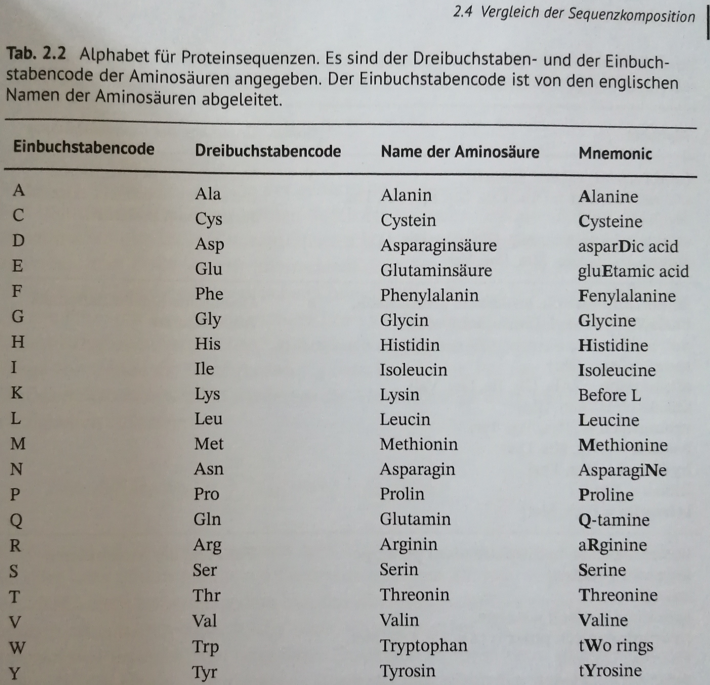
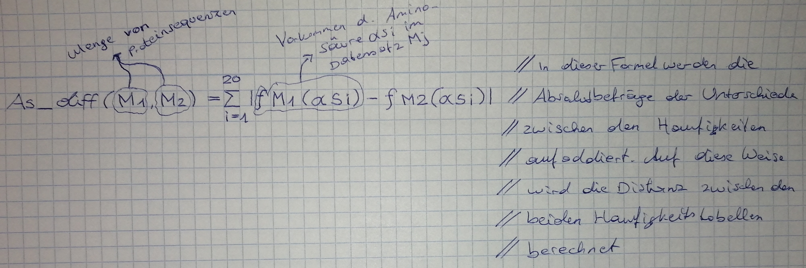

# I. basics - biology and databases

* [encode project](https://www.encodeproject.org/)
* [sources download](https://application.wiley-vch.de/HOME/bioinformatik/index.html)

## 1. basics in biology

### 1.1 dna

* [dna](https://en.wikipedia.org/wiki/DNA)

### 1.2 genetic code and gencomposition

* [genetic code](https://en.wikipedia.org/wiki/Genetic_code)

### 1.3 transcriptions

* [transcription (biology)](https://en.wikipedia.org/wiki/Transcription_(biology))

### 1.4 rna

* [rna](https://en.wikipedia.org/wiki/RNA)

### 1.5 proteins 

* [protein](https://en.wikipedia.org/wiki/Protein)

### 1.6 peptide bonding

* [peptide bond](https://de.wikipedia.org/wiki/Peptidbindung)

### 1.7 Konformation von Aminosäureseitenketten (Conformation of amino acid side chains)

* [amino acid](https://en.wikipedia.org/wiki/Amino_acid)
* [side chain](https://en.wikipedia.org/wiki/Side_chain)

### 1.8 ramachandran plot

* [ramachandran plot](https://en.wikipedia.org/wiki/Ramachandran_plot)

### 1.9 hierarchical description of protein structures

* [protein structure](https://en.wikipedia.org/wiki/Protein_structure)

### 1.10 secondary structural elements

* [protein secondary structure](https://en.wikipedia.org/wiki/Protein_secondary_structure)

### 1.11 alpha-helix

* [alpha helix](https://en.wikipedia.org/wiki/Alpha_helix)

### 1.12 beta sheet

* [beta sheet](https://en.wikipedia.org/wiki/Beta_sheet)

### 1.13 super secondary structure elements

* [super secondary structures](https://www.spektrum.de/lexikon/biochemie/supersekundaerstrukturen/6022)

### 1.14 proein domains

* [protein domain](https://en.wikipedia.org/wiki/Protein_domain)

### 1.15 proteinfamilies

* [proteinfamily](https://en.wikipedia.org/wiki/Protein_family)

### 1.16 enzyme

* [enzyme](https://en.wikipedia.org/wiki/Enzyme)

### 1.17 protein complex

* [protein complex](https://en.wikipedia.org/wiki/Protein_complex)

### 1.18 evolutionaray processes

* [evolutionary processes](https://de.wikipedia.org/wiki/Evolution#:~:text=Diese%20Prozesse%20sind%20die%20zentrale,%2C%20Rekombination%2C%20Selektion%20und%20Gendrift.)

### 1.19 technical terms

 * [homology](https://www.bionity.com/de/lexikon/Homologie_%28Biologie%29.html)
 * [genotype](https://en.wikipedia.org/wiki/Genotype)
 * [phenotype](https://en.wikipedia.org/wiki/Phenotype)
 * [prokaryote](https://en.wikipedia.org/wiki/Prokaryote)
 * [eukaryote](https://en.wikipedia.org/wiki/Eukaryote)
 * [nomenklatur (biologie)](https://de.wikipedia.org/wiki/Nomenklatur_(Biologie))
 * [microorganism](https://en.wikipedia.org/wiki/Microorganism)
 * [gram stain](https://en.wikipedia.org/wiki/Gram_stain)
 * [genome](https://en.wikipedia.org/wiki/Genom)
 * [metagenomics](https://en.wikipedia.org/wiki/Metagenomics)
 * [systembiologie](https://en.wikipedia.org/wiki/Systems_biology)
 * [genomics](https://en.wikipedia.org/wiki/Genomics)
 * [transcriptome](https://en.wikipedia.org/wiki/transcriptome)
 * [proteomik](https://de.wikipedia.org/wiki/Proteomik)
 * [Metabolomics](https://en.wikipedia.org/wiki/Metabolomics)
 * [in vitro](https://en.wikipedia.org/wiki/In_vitro)
 * [in vivo](https://en.wikipedia.org/wiki/In_vivo)
                      
## 2 sequenzen and their functions

### 2.1 definitions and operators

* [dna sequencing](https://en.wikipedia.org/wiki/DNA_sequencing)
* [rna sequencing](https://en.wikipedia.org/wiki/Sequencing#RNA_sequencing)
* [protein sequencing](https://en.wikipedia.org/wiki/Protein_sequencing)

#### notation

   
#### examples for alphabets

* [american standard code for information interchange](https://en.wikipedia.org/wiki/ASCII)
* [Genetischer Code/Alphabet/ACGU/Beispiel](https://de.wikiversity.org/wiki/Genetischer_Code/Alphabet/ACGU/Beispiel)
* [amino acids](https://www.chemeurope.com/en/encyclopedia/Amino_acid.html)
* [nucleobases](https://en.wikipedia.org/wiki/Nucleobase)

##### alphabet for dna sequences

##### alphabet for protein sequences

##### alternative amino acid sequencies

### 2.2 dna sequencies

* [dna sequencing](https://en.wikipedia.org/wiki/DNA_sequencing)

### 2.3 protein sequencies

* [protein sequencing](https://en.wikipedia.org/wiki/Protein_sequencing)
   * [fasta format](https://en.wikipedia.org/wiki/FASTA_format)
   
Proteinsequenz des CAP-Monomers im FASTA Format:

   * [multiple-fasta-file](https://www.metagenomics.wiki/tools/fastq/multi-fasta-format)
   
### 2.4 compare sequence compositions

#### comparison of codon frequencies

#### Kompositionsanalyse und Metagenomprojekte

* In which applications is a comparison of the composition of sequences of interest:
   * optimization of heterogenic expressions
   * [metagenome projects](https://de.wikipedia.org/wiki/Metagenomik)

### 2.5 Ontologies

